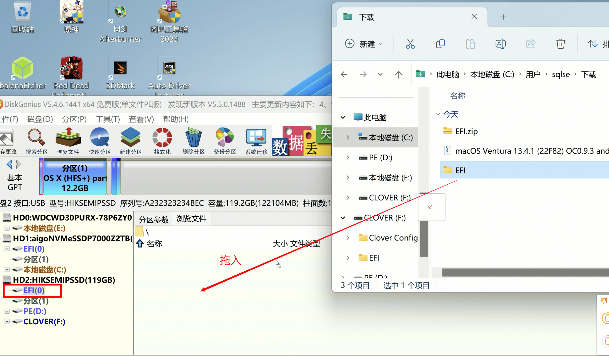

# Asus-Chromebox3-CN65-EFI
华硕CN65小主机黑苹果EFI，适用于MacOS 14.6.1

# 时间
2025年9月7日

# 机器情况
- 型号: Asus Chromebox3 CN65
- 处理器: Intel Core i7-8550U @ 1.80GHz 四核
- 主板：Google Teemo(英特尔 7/8th Soc(with iHDCP2.2 Premium))
- 显卡: Intel(R) UHD Graphics 620(128MB/英特尔)
- 内存: 英睿达 8GB DDR4 2400MHz(4GB+4GB) `内存随意`
- 存储: KBG40ZNS128G BG4A KIOXIA(128GB) `SSD随意`
- 声卡: 未知
- 网卡：Realtek PCle GbE Family Controller
- 无线网卡: Intel(R) Dual Band Wireless-Ac 7265
- 引导器: OpenCore 1.0.1
- macOS 版本: Sonoma.14.6.1(23G93)

# 安装步骤
1. **制作安装盘**
    - **MacOS环境**：参考 [macOS 恢复](https://support.apple.com/zh-cn/HT201372) 
    - **Windows环境**：下载 [刻录工具](https://etcher.balena.io/)
    
    另外需要准备一个WinPE环境的启动盘，便于安装后复制`EFI-BOOT`
2. **复制 EFI 文件夹**：创建 USB 安装盘后，Windows下使用diskgenius工具，将该仓库中的`EFI`文件夹替换到 USB 安装盘的 EFI 分区

3. **启动安装程序**：从 USB 启动安装程序，按照标准的 macOS 安装步骤进行操作（注意：安装过程中会重启，每次选择从U盘启动并选择安装程序，安装完成后硬盘名称将显示为格式化时输入的名称）
4. **安装后处理**：
    - 在安装 macOS 后，通过WinPE引导启动，将本项目中的 `EFI-BOOT` 文件夹复制到系统的 EFI 分区

# 感谢
- [最终版本](https://github.com/khgaurav/ASUS-Chromebox3-OpenCore)仓库的EFI文件
- [jingkunchen](https://github.com/jingkunchen/ASUS-Chromebox3-i7-8550U-Hackintosh)仓库的源文件
- [国光大神](https://www.sqlsec.com/2023/07/macbox.html)的刷机教程